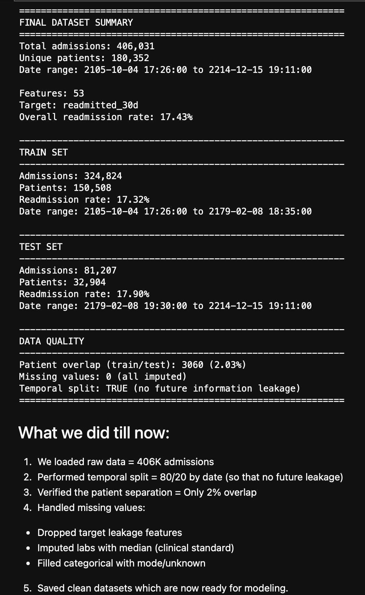

# Healthcare Readmission Risk Prediction Using Explainable AI

**MSc Computing (Data Analytics) - DCU - 2025-26**  
**Authors:** Robert Borkar & Niket Ahire 
**Supervisor:** Prof. Martin Crane

## Project Overview

Predicting hospital readmissions (30/60/90 days) using machine learning with explainable AI techniques (SHAP, LIME) to provide clinical interpretability.

**Dataset:** MIMIC-IV v3.1 (364,627 patients, 431,231 admissions)  
**Target:** AUROC ≥ 0.75 with clinically meaningful explanations

## Research Questions

**RQ1: Prediction Performance**
Can we predict 30-day hospital readmission using ensemble methods (Random Forest, XGBoost) with AUROC >0.80?

**RQ2: Neural Network Comparison**
Do LSTM neural networks with attention mechanisms improve prediction accuracy over traditional ML approaches?

**RQ3: Feature Importance**
Which clinical features (demographics, comorbidities, lab values, medications, historical admission patterns) are most predictive of readmission using SHAP and LIME explainability methods?

**RQ4: Clinical Validation**
Can SHAP/LIME identified risk factors be validated against existing clinical literature on readmission predictors?

**RQ5: Model Interpretability**
Can neural networks be made explainable using SHAP/LIME, proving they are not "black boxes"?

**Secondary Question**: Can we also predict length of stay as an alternative utilitarian metric?

## Project Structure
```
├── sql/                          # BigQuery SQL queries
│   ├── 01_data_exploration/      # Initial dataset analysis
│   ├── 02_cohort_definition/     # Inclusion/exclusion criteria
│   ├── 03_feature_engineering/   # Feature extraction queries
│   └── 04_model_queries/         # Final dataset generation
├── notebooks/                    # Jupyter notebooks for analysis
├── src/                          # Python source code
├── models/                       # Trained model artifacts
├── results/                      # Figures, tables, performance metrics
└── docs/                         # Documentation and reports
```

## Project Timeline

### Phase 1: Data Access & Exploration(COMPLETE)
**Completed:** October-November 2024

- CITI training certification obtained
- MIMIC-IV v3.1 access granted via PhysioNet
- BigQuery workspace configured
- Initial data exploration (364,627 patients, 431,231 admissions)
- Cohort definition: 406,031 admissions meeting inclusion criteria
- Readmission rate validated: 17.43% (30-day)
- Panel presentation completed & approved

**Key Decisions:**
- Exclusion criteria: Deaths, pediatric (<18), short stays (<24h)
- Quality filters: Admissions >24 hours, readmissions >24 hours post-discharge
- Temporal validation approach confirmed (no random splits)

---

### Phase 2: Feature Engineering(COMPLETE)
**Completed:** December, 2024

**Features Extracted:** ~50 features across 6 categories

1. **Demographics (13 features)**
   - Age, gender, race, marital status, language
   - Insurance type, admission type/location
   - Length of stay (hours, days)

2. **Comorbidities (10 features)**
   - Charlson Comorbidity Index components
   - Total diagnosis count

3. **Lab Values (13 features)**
   - Critical labs: hemoglobin, WBC, creatinine, sodium, potassium, glucose
   - Abnormal test counts (first 24h)

4. **Medications (6 features)**
   - Polypharmacy flags
   - High-risk categories: anticoagulants, insulin, opioids, antibiotics

5. **Historical Admissions (7 features)**
   - Prior admissions (30/90/365 day windows)
   - Days since last discharge
   - Frequent flyer identification

6. **Target Variables (4 features)**
   - Readmission flags: 30/60/90 day windows

**SQL Queries:** `sql/03_feature_engineering/` (01-07)

**Output Dataset:**
- File: `data/processed/mimic_readmission_final.csv`
- Rows: 406,031 admissions
- Features: ~50 variables
- Size: 96MB

**Key Findings:**
- 98% patients on >5 medications (polypharmacy universal)
- Prior 30-day admissions = strongest readmission predictor
- Frequent flyers identified (6+ consecutive readmissions)
- Lab abnormalities: 0-150+ in first 24 hours

---

### Phase 3: Data Preprocessing & Validation(COMPLETE)
**Completed:** January 3, 2026

**Missing Value Handling:**
- Dropped target leakage features (`days_to_next_admission`)
- Lab values: Median imputation (clinical standard)
- Categorical: Mode/UNKNOWN imputation
- Historical features: -1 for first-time patients
- **Result:** 0 missing values

**Train/Test Split:**
- **Method:** Temporal split (80/20)
- **Split date:** 2179-02-08
- **Train:** 324,824 admissions (17.32% readmission)
- **Test:** 81,207 admissions (17.90% readmission)
- **Patient overlap:** 2.03% (acceptable for temporal split)

**Data Quality Validation:**
- No target leakage  
- Temporal ordering preserved (train on past, test on future)  
- Class balance maintained across splits (±0.6%)  
- Minimal patient overlap between sets  

**Outputs:**
- `data/processed/train_data_clean.csv` (324K rows)
- `data/processed/test_data_clean.csv` (81K rows)
---

### Dataset Statistics



**Key Metrics:**
- Total admissions: 406,031
- Unique patients: ~183K
- Features: 50
- Train/Test split: 324,824 / 81,207 (80/20 temporal)
- Readmission rate: Train 17.32%, Test 17.90%
- Patient overlap: 2.03% (acceptable for temporal split)
- Missing values: 0 (all imputed using clinical standards)

**Data Quality Assurance:**
- Temporal validation (train on past, test on future)  
- No target leakage  
- Minimal patient overlap between sets  
- Class balance maintained across splits
---

### Phase 4: Model Development(IN PROGRESS)
**Started:** January 11, 2026

#### Current Status: Baseline Models

**Completed:**
- Exploratory Data Analysis (age, comorbidities, historical admissions, lab values)
- Feature correlation analysis (top predictors identified)

**In Progress:**
- Baseline model training (Logistic Regression, XGBoost)

**Next Steps:**
- AUROC/AUPRC evaluation
- Class imbalance handling (SMOTE, cost-sensitive learning)
- LSTM + Attention architecture

**Modeling Strategy:**
```
Baseline Models → Neural Networks → Explainability → Clinical Validation
     ↓                   ↓                ↓                  ↓
  XGBoost          LSTM+Attention       SHAP/LIME      Literature Review
  LogReg           Temporal Patterns    Feature Ranks   Clinical Validity
```

---

### Phase 5: Explainability & Validation(PLANNED)
**Target:** February-March 2026

- SHAP global feature importance
- LIME local patient explanations
- t-SNE patient clustering
- Clinical literature validation
- Model comparison analysis

---

### Phase 6: Final Report & Presentation(PLANNED)
**Target:** April 2026

- Technical report writing
- Results visualization
- Presentation preparation
- Code/documentation finalization
---

## Contact

1. Robert Borkar - robert.borkar2@mail.dcu.ie
2. Niket Ahire - niketsuresh.ahire2@mail.dcu.ie

